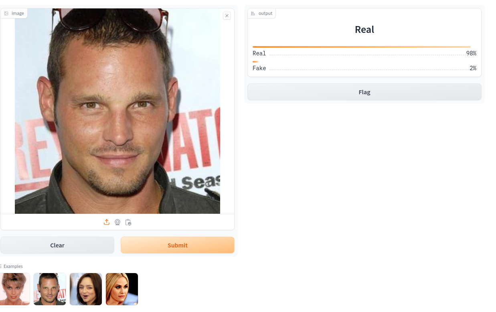

# DeepfakeImageDetection
python version: 3.8.5

torch.__version__: '2.4.0+cu121'

torch.version.cuda: '12.1'

other requirements can be found in requirements.txt

launch:

python app.py

need to replace or delete the example images in app.py

